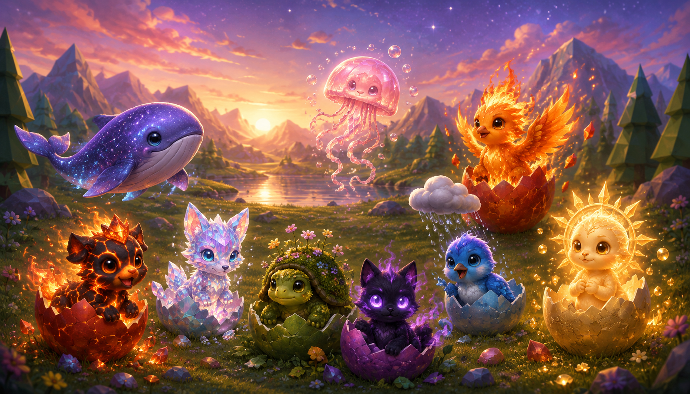
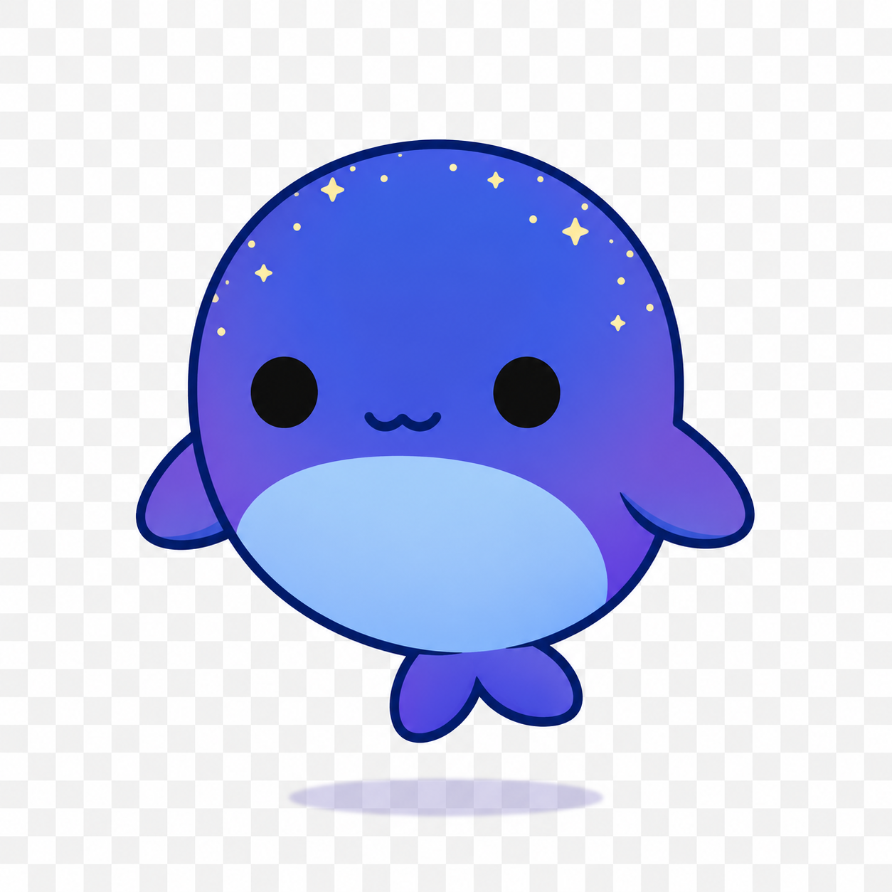
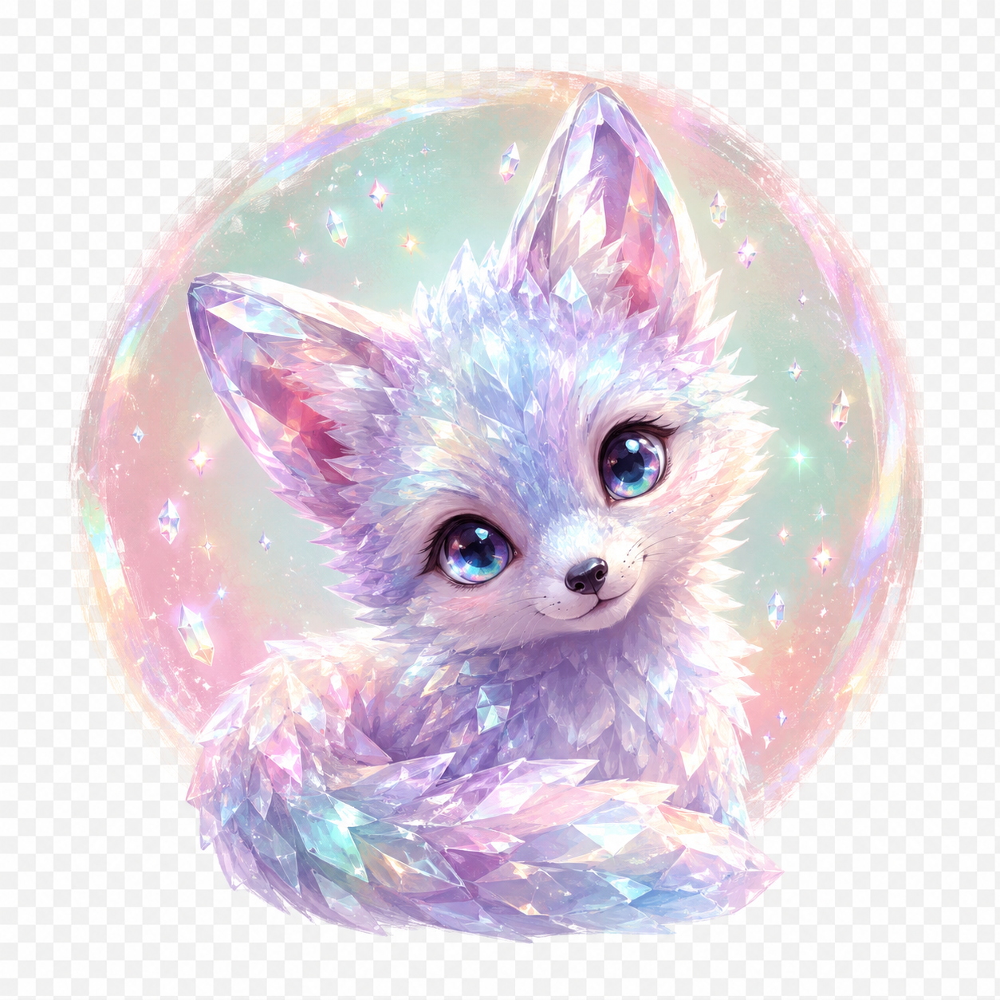
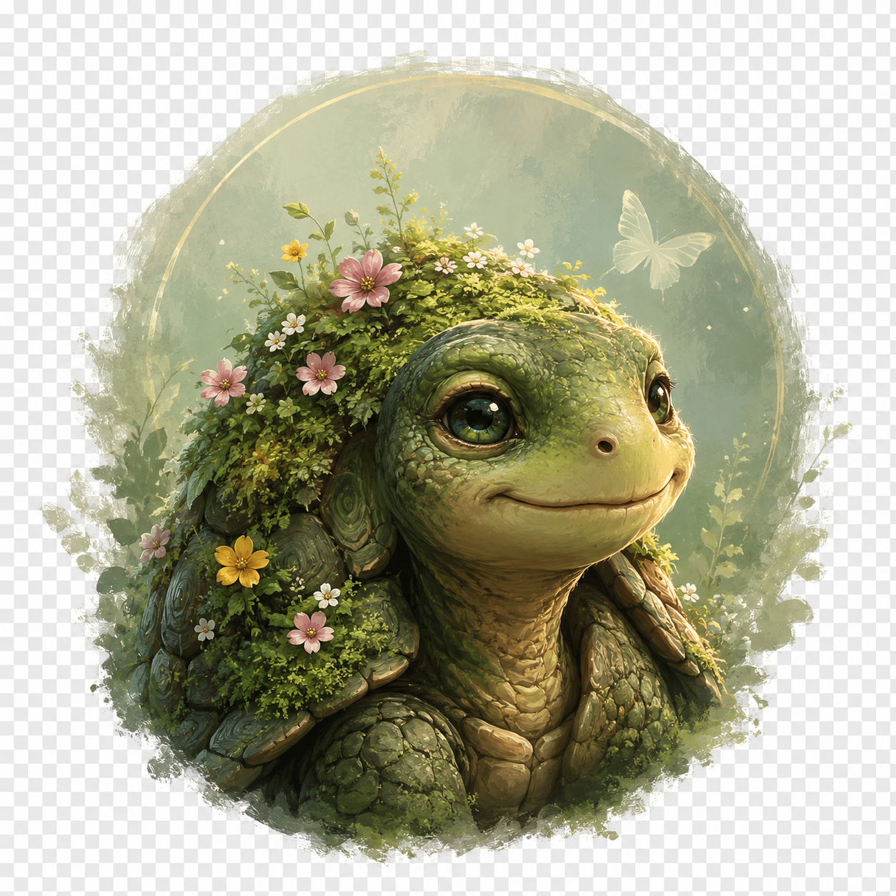
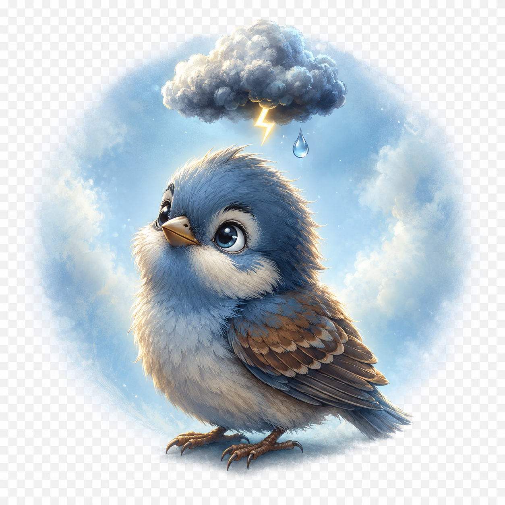
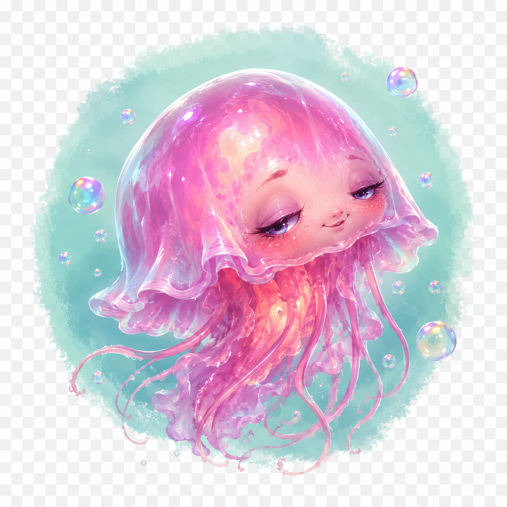
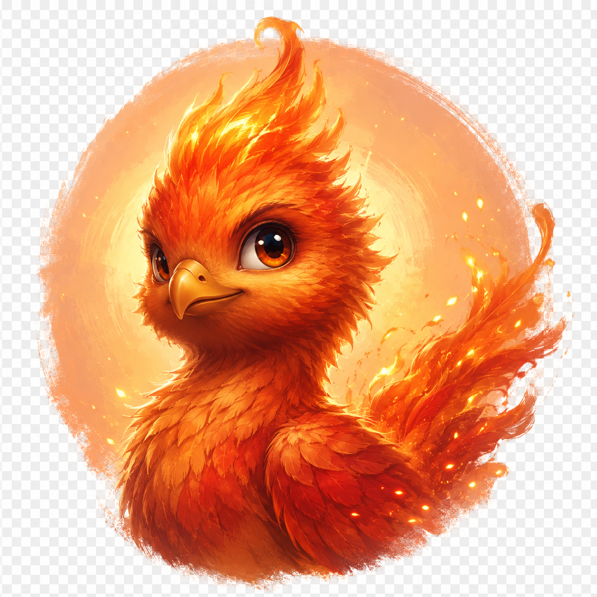
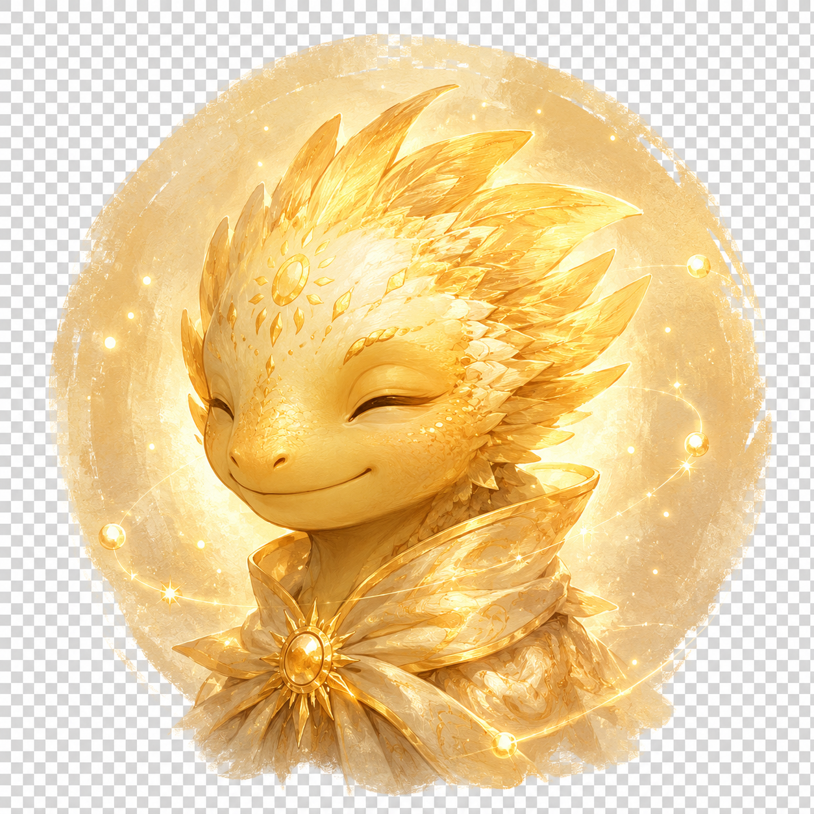

# BlueChicken — The Hatchling World (3D)



A small, dependency-free 3D web app. Nine eggs, nine very different souls inside, and a living valley where wolves, UFOs, polar bears, winters, and meteor showers all visit on their own schedule.

## The hatchlings

|                                                |                                              |                                              |
|------------------------------------------------|----------------------------------------------|----------------------------------------------|
|    |    |   |
| **Aurora** — Sky-Whale                         | **Magma** — Lava Pup                         | **Glimmer** — Crystal Fox                    |
|  |  |        |
| **Mossback** — Garden Turtle                   | **Whisper** — Shadow Cat                     | **Pip** — Storm Sparrow                      |
|    |    |     |
| **Bubble** — Deep Jelly                        | **Ember** — Phoenix Chick                    | **Solis** — The First Egg                    |

All character portraits and the title splash (`docs/title.png`) were generated via the whip MCP connector (ChatGPT image-gen) and matched to a single painterly storybook style.

## Run

Open `index.html` in any modern browser. There is no build step and no server. Three.js loads from a CDN via an `<script type="importmap">`; if you're offline, swap the importmap URLs for a local copy of the same files.

```
xdg-open index.html         # Linux
open index.html             # macOS
start index.html            # Windows
```

## The roster

| #  | Name      | Hatches as          | What only they can do                          |
|----|-----------|---------------------|------------------------------------------------|
| 1  | Aurora    | Sky-Whale           | Sings a constellation into the night sky       |
| 2  | Magma     | Lava Pup            | Dashes across the world leaving scorch trails  |
| 3  | Glimmer   | Crystal Fox         | Refracts the sun into a seven-band rainbow     |
| 4  | Mossback  | Garden Turtle       | Plants grow on her shell over time             |
| 5  | Whisper   | Shadow Cat          | Teleports between shadows, leaving riddles     |
| 6  | Pip       | Storm Sparrow       | Pocket rain cloud that makes flowers bloom     |
| 7  | Bubble    | Deep Jelly          | Releases memory bubbles you can pop            |
| 8  | Ember     | Phoenix Chick       | Reborn from flame in a new feather color       |
| 9  | Solis     | The First Egg       | Hidden — appears when the other eight are joyful |

## The world

- Round valley with a pond, trees, and rocks. Distance fog gives it scale.
- Real-time **dawn → day → dusk → night** cycle (~6 min per loop). Sun rides an arc, stars fade in at night, sky/light/fog colors blend continuously.
- Free-look camera: drag to orbit, scroll to zoom.
- Each hatchling wanders, prefers different times of day, and reacts to petting and dragging. Aurora cruises in the air; Bubble drifts above the pond.

## Events that visit on their own

A scheduler picks one of these every 25–55 seconds (no overlap):

- **UFO Visit** — a disc descends with rim lights, casts a green beam, then drifts off.
- **First Contact** — the first time after a UFO has been seen, it returns and drops off an alien who waddles over to befriend the nearest hatchling.
- **Wolf** — a lone wolf crosses the valley.
- **Winter Sequence** — the world cools (lights desaturate to cold blue), snow falls as a particle system, three igloos rise from the drifts, a polar bear lumbers through, then a slow thaw restores summer.
- **Aurora Borealis** — colored ribbons undulate across the night sky.
- **Meteor Shower** — bright streaks at night.
- **Eclipse** — the sun dims; the world holds its breath, then returns.

## Controls

- **Drag** the world to orbit; **scroll** to zoom; the ground is the floor.
- **Tap an egg** — six taps to hatch. Egg wiggles each tap; shrinks slightly as the cracks deepen.
- **Tap a hatchling** — pets them (joy goes up) and opens their journal.
- **Drag a hatchling** — carry them to a new spot. Ground creatures snap to the ground plane; flying/floating ones to their natural altitude.
- **Roster pip (gold dot)** — fire that character's special directly.
- **Tap a memory bubble** — pop it before it drifts away.

## Files

- `index.html` — page, importmap, HUD, roster, inspector
- `styles.css` — overlay UI (glass-blur HUD, roster, inspector, toast)
- `characters3d.js` — the nine hatchlings: low-poly `THREE.Group` factories + story + special + portrait + model
- `events.js` — `EventDirector` scheduler + every event (UFO, first contact, wolf, winter, igloos, polar bear, aurora borealis, meteors, eclipse) + character-special effects (constellation, rainbow, pip rain, memory bubble, rebirth)
- `world3d.js` — scene scaffolding, terrain, time/weather, actor management, helpers used by events and specials; preloads `docs/models/<id>.glb` if present and uses them in place of the procedural meshes
- `main3d.js` — boot, camera (OrbitControls), raycaster (tap egg / actor / bubble), Solis gate, game loop
- `docs/portraits/<id>.png` — painterly portraits used by the roster + inspector + hatch reveal (Whip / ChatGPT image-gen)
- `docs/title.png` — title-screen splash (Whip / ChatGPT image-gen)
- `docs/models/<id>.glb` — *optional* Tripo-generated character meshes. Drop a `.glb` named after a character id here and `world3d.js` auto-loads it and uses it in place of the procedural mesh (auto-fits height to ~1.4 units and recenters feet at y=0).

